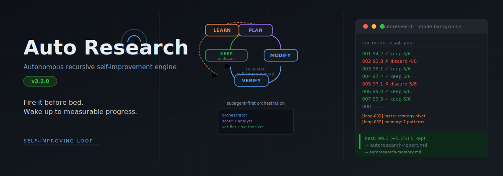
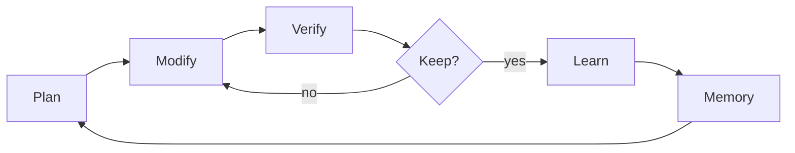
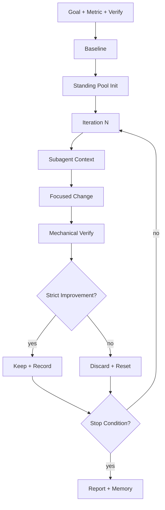
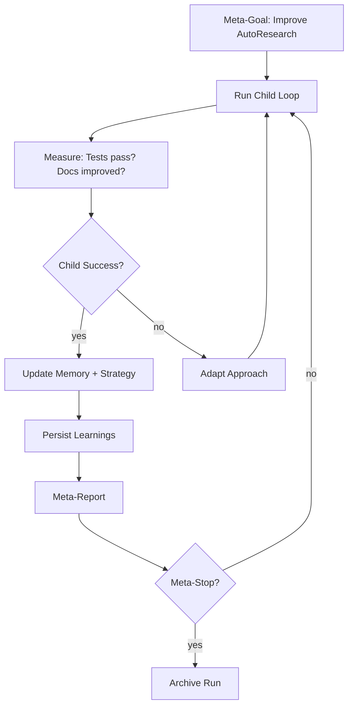
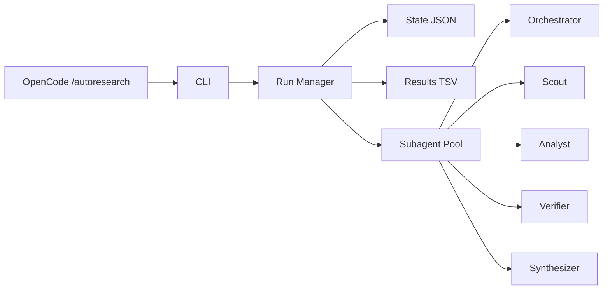

# Auto Research

<p align="center">
  
</p>

<p align="center">
  <a href="https://github.com/Maleick/AutoResearch/stargazers"></a>
  <a href="https://github.com/Maleick/AutoResearch/commits/main"></a>
  <a href="https://github.com/Maleick/AutoResearch/releases"></a>
  <a href="LICENSE"></a>
  <a href="https://autoresearch.teamoperator.red"></a>
</p>

<p align="center">
  <a href="https://autoresearch.teamoperator.red">Docs</a> •
  <a href="https://github.com/Maleick/AutoResearch/wiki">Wiki</a> •
  <a href="#commands">Commands</a> •
  <a href="#runtime">Runtime</a> •
  <a href="#self-improvement-loop">Self-Improvement</a>
</p>

<p align="center"><strong>Autonomous recursive self-improvement engine for OpenCode.</strong></p>

```text
┌──────────────────────────────────────────────┐
│  ITERATION MODEL        Subagent-first        │
│  ORCHESTRATION          Standing pool         │
│  VERIFICATION           Mechanical metrics    │
│  PERSISTENCE            State + Memory        │
│  META-LEARNING          Strategy adaptation   │
└──────────────────────────────────────────────┘
```

## What It Does

Auto Research is a **subagent-first autonomous iteration engine** that runs structured improve-verify loops inside OpenCode. Unlike simple task runners, it maintains a standing pool of specialized subagents, persists learnings across iterations, and can run recursive self-improvement loops on its own codebase.

- **Plans** experiments from a measurable goal
- **Modifies** one focused change per iteration
- **Verifies** mechanically — never on intuition alone
- **Keeps or discards** based on strict metric improvement
- **Learns** from patterns across iterations
- **Repeats** until the stop condition is met

## The Core Loop





## The Self-Improvement Loop

Auto Research can run on itself. The recursive loop adds a meta-orchestrator that:



See [`skills/autoresearch/references/self-improve-loop.md`](skills/autoresearch/references/self-improve-loop.md) for the full recursive loop specification.

## Installation

Install the CLI globally if you want Auto Research available long-term on your PATH:

```bash
npm install -g opencode-autoresearch
opencode-autoresearch doctor
```

For a one-time install without keeping a global CLI, use `bunx` instead:

```bash
bunx opencode-autoresearch install
bunx opencode-autoresearch doctor
```

Then start the setup wizard inside OpenCode:

```text
/autoresearch
```

## Quick Start

```bash
# 1. Install the CLI globally
npm install -g opencode-autoresearch

# 2. Verify installation
opencode-autoship doctor

# 3. Navigate to your project
cd ~/Projects/my-project

# 4. Start Auto Research in OpenCode
/autoresearch
```

## Runtime Surfaces

| Surface | Entry point |
| --- | --- |
| OpenCode | `/autoresearch`, `/autoresearch:plan`, `/autoresearch:debug`, `/autoresearch:fix`, `/autoresearch:learn`, `/autoresearch:predict`, `/autoresearch:scenario`, `/autoresearch:security`, `/autoresearch:ship` |

## Commands

| Command | Purpose |
| --- | --- |
| `/autoresearch` | Default improve-verify loop |
| `/autoresearch:plan` | Planning workflow |
| `/autoresearch:debug` | Debugging workflow |
| `/autoresearch:fix` | Fix workflow |
| `/autoresearch:learn` | Learning workflow |
| `/autoresearch:predict` | Prediction workflow |
| `/autoresearch:scenario` | Scenario expansion |
| `/autoresearch:security` | Security review |
| `/autoresearch:ship` | Ship-readiness workflow |

## CLI Commands

| Command | Purpose |
| --- | --- |
| `autoresearch init` | Initialize a run |
| `autoresearch wizard` | Generate setup summary |
| `autoresearch status` | Print run status |
| `autoresearch launch` | Launch background run |
| `autoresearch stop` | Request stop |
| `autoresearch resume` | Resume background run |
| `autoresearch complete` | Mark run complete |
| `autoresearch record` | Record iteration result |
| `autoresearch doctor` | Verify installation |

## Architecture



## Runtime Artifacts

| Artifact | Purpose |
| --- | --- |
| `.autoresearch/state.json` | Checkpoint state for the current run |
| `autoresearch-results.tsv` | Iteration log |
| `autoresearch-report.md` | End-of-run report |
| `autoresearch-memory.md` | Reusable memory for later runs |
| `.autoresearch/launch.json` | Background launch manifest |

## Self-Improvement Mode

Run Auto Research on its own codebase:

```bash
# Initialize a recursive self-improvement run
autoresearch init \
  --goal "Improve test coverage and documentation" \
  --metric "coverage_pct" \
  --direction "higher" \
  --verify "npm run test:coverage" \
  --guard "npm run typecheck" \
  --mode "background" \
  --iterations "20"

# Check status
autoresearch status

# Resume if stopped
autoresearch resume
```

The self-improvement loop:
1. Baselines current state (tests, docs, metrics)
2. Dispatches subagents to identify improvement opportunities
3. Makes one focused change per iteration
4. Verifies mechanically (tests, typechecks, lint)
5. Keeps strict improvements, discards regressions
6. Records patterns to `autoresearch-memory.md`
7. Adapts strategy when repeated discards occur
8. Continues until iteration cap or goal met

## Subagent Pool

The standing pool provides specialized roles reused across iterations:

| Role | Purpose |
| --- | --- |
| `orchestrator` | Owns goal, state, and keep/discard decisions |
| `scout` | Gathers context and surfaces opportunities |
| `analyst` | Challenges hypotheses and identifies risks |
| `verifier` | Runs mechanical verification independently |
| `synthesizer` | Compiles findings into next iteration plan |
| `security_reviewer` | Security-focused review variant |
| `debugger` | Debug workflow specialization |
| `release_guard` | Ship-readiness verification |
| `research_tracker` | Pattern tracking across iterations |

## Development

```bash
npm run typecheck   # TypeScript strict checks
npm run build       # Compile TypeScript to dist/
npm run test        # Run test suite
npm pack --dry-run  # Preview shipped package contents
```

## Repository Layout

```text
src/                           # TypeScript source (runtime helpers, CLI, subagent pool)
dist/                          # Compiled JavaScript output
commands/                      # OpenCode command surfaces
skills/autoresearch/           # Skill bundle with references
  references/                  # Workflow and runtime references
    core-principles.md         # Loop discipline
    loop-workflow.md           # Main iteration workflow
    subagent-orchestration.md  # Pool management
    state-management.md        # State semantics
    self-improve-loop.md       # Recursive self-improvement
hooks/                         # Shell hooks for session lifecycle
docs/                          # Install and architecture docs
wiki/                          # GitHub wiki pages
.autoresearch/                 # Runtime state directory
.opencode-plugin/              # Plugin manifest
```

## Notes

- This is an **OpenCode-only** package. No Claude or Codex runtime is supported.
- The CLI uses Node.js ESM modules.
- Self-improvement loops require `--mode background` for long-running unattended operation.
- Memory files (`autoresearch-memory.md`) are portable across runs and repositories.

## License

MIT — See [LICENSE](LICENSE) for details.
