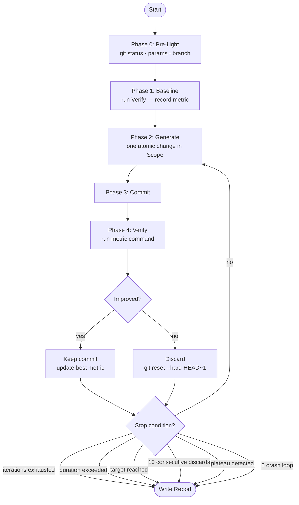
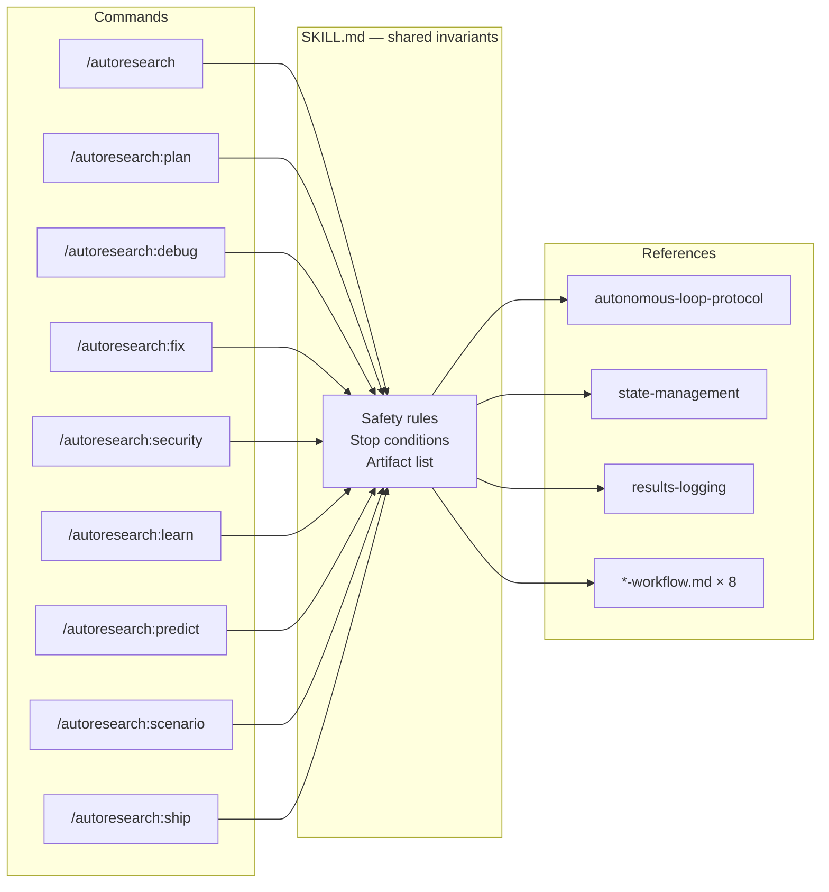

# Autoresearch

[](https://github.com/Maleick/claude-autoresearch/releases)
[](LICENSE)
[](plugins/autoresearch/commands/autoresearch.md)
[](https://github.com/Maleick/claude-autoresearch/commits/main)
[](https://github.com/Maleick/claude-autoresearch/stargazers)
[](.)
[](CHANGELOG.md)
[](https://claude.ai/download)
[](.)
[](CONTRIBUTING.md)
[](https://github.com/sponsors/Maleick)


> **v2.2.1** — [Website](https://maleick.github.io/claude-autoresearch/) · [Issues](https://github.com/Maleick/claude-autoresearch/issues)

Autonomous overnight iteration engine for [Claude Code](https://claude.ai/claude-code). Fire it before bed, review improvements in the morning.

Inspired by [Karpathy's autoresearch](https://github.com/karpathy/autoresearch). Applies constraint-driven autonomous iteration to any git-backed codebase with a deterministic verification command.

**Core loop:** Modify → Verify → Keep/Discard → Repeat.

## What It Does

You give autoresearch a goal, a scope (which files to touch), and a verification command that outputs a number. It then autonomously:

1. Creates an isolated `autoresearch/<timestamp>` branch
2. Makes one small, atomic change
3. Commits it
4. Runs your verification command
5. Keeps the change if the metric improved (strict improvement only — equal values are discarded), resets if it didn't
6. Repeats until iterations run out, time expires, or it gets stuck

Every kept change is a git commit on the isolated branch. Every discarded change is cleanly reset (no revert commits). In the morning you get a structured report (file + terminal summary) showing what happened.

## Commands

| Command                  | Purpose                                                               |
| ------------------------ | --------------------------------------------------------------------- |
| `/autoresearch`          | Core autonomous loop — runs unattended                                |
| `/autoresearch:plan`     | Interactive setup wizard — builds your config                         |
| `/autoresearch:debug`    | Scientific-method bug hunting                                         |
| `/autoresearch:fix`      | Iterative error repair until zero remain                              |
| `/autoresearch:security` | Autonomous security audit — STRIDE + OWASP Top 10 + red-team personas |
| `/autoresearch:learn`    | Autonomous codebase documentation engine                              |
| `/autoresearch:predict`  | Multi-persona swarm analysis from expert views                        |
| `/autoresearch:scenario` | Scenario-driven use case & edge case generator                        |
| `/autoresearch:ship`     | Structured shipping workflow (PR, release notes, deploy checklist)    |

## Quick Start

### Prerequisites

- [Claude Code](https://claude.ai/claude-code) with marketplace plugin support
- A git-backed codebase with a clean working tree (no uncommitted changes)
- A deterministic verification command that outputs a number

### Install

```bash
claude plugin marketplace add Maleick/claude-autoresearch && claude plugin install autoresearch@Maleick-claude-autoresearch
```

<details>
<summary>Manual steps</summary>

```bash
# Add the marketplace source
/plugin marketplace add Maleick/claude-autoresearch

# Install the plugin
/plugin install autoresearch@Maleick-claude-autoresearch

# Reload to activate
/reload-plugins
```

</details>

### Update

Auto-update is enabled by default in v2.2.0 — the marketplace poller detects new versions automatically.

To update manually:

```bash
/plugin marketplace update Maleick/claude-autoresearch
```

### Use

```bash
# Use the wizard to set up your first run
/autoresearch:plan

# Or configure directly
/autoresearch Goal: "Reduce bundle size" Scope: "src/**/*.ts" Metric: "bundle size KB" Verify: "npm run build 2>&1 | grep 'bundle size' | awk '{print $3}'" Direction: minimize Iterations: 50
```

## How It Works



## Architecture



Each command reads `SKILL.md` for shared invariants, then reads its corresponding `*-workflow.md` for the specific execution protocol.

## Running Overnight

### Option 1: Manual (Simple)

Open a terminal with `tmux` or a persistent session:

```bash
claude
> /autoresearch Goal: "..." Scope: "..." Metric: "..." Verify: "..." Iterations: 50 Duration: 8h
```

Leave it running. Check in the morning.

### Option 2: Scheduled (Recommended)

Use Claude Code's `/schedule` to create a recurring overnight job:

```bash
/schedule "autoresearch on my-project" --cron "0 1 * * *" --project ~/Projects/my-project
```

Runs at 1 AM daily. Writes report when done.

## Safety

- **Branch isolation** — all work happens on `autoresearch/<timestamp>`, never on your default branch. Note: this protects git history only — `Verify:` and `Guard:` commands still execute on the host machine and can have side effects outside of git
- **Clean working tree required** — the loop checks `git status --porcelain` before starting and at every iteration. Dirty tree = stop. Untracked files in the working directory may be removed by `git clean -fd` during discard
- **Clean discard** — failed experiments are reset (`git reset --hard HEAD~1` + `git clean -fd`), not reverted — no commit spam
- **One change per iteration** — atomic, reviewable diffs only
- **Mechanical verification** — metrics come from running commands, never from LLM self-assessment
- **Guard commands** — a command that must always pass (e.g., `npm test`) prevents breaking changes
- **Command timeouts** — `Verify:` and `Guard:` commands have a hard timeout (default 300s). Timeout is treated as a crash
- **Bounded iterations** — default 50, soft cap at 100 (override with `--no-limit`)
- **Duration limits** — set `Duration: 8h` to cap wall-clock time
- **State persistence** — loop state is checkpointed to `autoresearch-state.json` after every phase, enabling `--resume` after crashes. On resume, executable commands come from the current invocation, not the state file.
- **Fail-fast** — all non-plan commands fail immediately on missing required parameters (no interactive prompts mid-loop)

## Output Artifacts

When the run finishes, you get:

| Artifact                   | Description                                                     |
| -------------------------- | --------------------------------------------------------------- |
| `autoresearch-report.md`   | Detailed report with every change, metrics, and recommendations |
| `autoresearch-results.tsv` | Iteration log scoped by `run_id` — every attempt with metrics   |
| `autoresearch-state.json`  | Checkpoint state for `--resume` after crashes                   |
| Terminal summary           | Quick stats if you check the session                            |

Sub-command specific artifacts:

| Artifact                         | Created By                                                   |
| -------------------------------- | ------------------------------------------------------------ |
| `autoresearch-debug-findings.md` | `/autoresearch:debug`                                        |
| `autoresearch-security/`         | `/autoresearch:security` — audit artifacts and PoC directory |

All runtime artifacts are gitignored.

## Configuration Reference

### Required Parameters

| Parameter | Description                        | Example                                              |
| --------- | ---------------------------------- | ---------------------------------------------------- |
| `Goal:`   | What to improve (natural language) | `"Reduce test execution time"`                       |
| `Scope:`  | File globs to modify               | `"src/**/*.ts"`                                      |
| `Metric:` | What the verify command measures   | `"test duration in seconds"`                         |
| `Verify:` | Command that outputs a number      | `"npm test 2>&1 \| grep 'Time' \| awk '{print $2}'"` |

### Optional Parameters

| Parameter                        | Default               | Description                                                                                                                            |
| -------------------------------- | --------------------- | -------------------------------------------------------------------------------------------------------------------------------------- |
| `Guard:`                         | none                  | Command that must exit 0 after each change                                                                                             |
| `Iterations:` / `--iterations N` | 50                    | Max iterations (soft cap: 100, use `--no-limit` to override)                                                                           |
| `Duration:`                      | none                  | Max wall-clock time (`6h`, `90m`, etc.)                                                                                                |
| `Direction:`                     | maximize              | `maximize` or `minimize` the metric                                                                                                    |
| `Target:`                        | none                  | Numeric target value — loop stops when the metric reaches this value (respecting Direction)                                            |
| `MetricPattern:`                 | last number in stdout | Regex to extract the metric from Verify output (e.g., `"score: ([0-9.]+)"`)                                                            |
| `Timeout:`                       | 300                   | Per-command timeout in seconds for Verify and Guard commands. Timeout = crash                                                          |
| `--no-limit`                     | off                   | Remove the 100-iteration soft cap                                                                                                      |
| `--resume`                       | off                   | Resume a previous run from `autoresearch-state.json`. Restores iteration count, branch, and best metric; re-supply `Verify:` on resume |

### Stop Conditions

The loop stops when any of these triggers:

| Condition       | Trigger                                                                     |
| --------------- | --------------------------------------------------------------------------- |
| Iteration limit | `iteration >= max_iterations`                                               |
| Duration limit  | Wall-clock time exceeds `Duration:` value                                   |
| Metric goal     | Metric reached or passed `Target:` value (respecting Direction)             |
| Stuck           | 10 consecutive discards                                                     |
| Plateau         | Last 20 iterations had <1% cumulative metric improvement                    |
| Crash loop      | 5 consecutive crashes (Verify/Guard command appears broken)                 |
| Goal satisfied  | Qualitative goal met — all Scope files pass verify + guard with no findings |

## Command Reference

### `/autoresearch` — Core Optimization Loop

Run with no arguments to launch the **guided wizard** (added in v2.0.0), which walks you through parameter collection interactively.

Or provide parameters directly:

```bash
/autoresearch Goal: "Reduce bundle size" Scope: "src/**/*.ts" Metric: "bundle size KB" Verify: "npm run build 2>&1 | grep size | awk '{print $3}'" Direction: minimize --iterations 50
```

**Flags:**

| Flag             | Description                                           |
| ---------------- | ----------------------------------------------------- |
| `--iterations N` | Run exactly N iterations then stop                    |
| `--resume`       | Resume from `autoresearch-state.json`                 |
| `--force-branch` | Skip branch safety check (use on feature branches)    |
| `--no-limit`     | Remove 100-iteration soft cap (pair with `Duration:`) |
| `--dry-run`      | Validate config without running iterations            |
| `--notify`       | Print completion summary to stdout (useful for tmux)  |

### `/autoresearch:plan` — Setup Wizard

Interactively builds Goal, Scope, Metric, and Verify from a free-text description.

```bash
/autoresearch:plan "I want to speed up my test suite"
```

### `/autoresearch:debug` — Bug Hunter

Scientific-method investigation that surfaces multiple bugs, not just the first one.

```bash
/autoresearch:debug --scope "src/**/*" --symptom "intermittent timeout in auth module" --iterations 10
```

**Flags:**

| Flag                 | Description                                                         |
| -------------------- | ------------------------------------------------------------------- |
| `--fix`              | Auto-fix found bugs                                                 |
| `--scope <glob>`     | Files to investigate                                                |
| `--symptom <text>`   | Describe the observed problem                                       |
| `--severity <level>` | Filter by severity                                                  |
| `--technique <name>` | Specify investigation technique                                     |
| `--iterations N`     | Bounded mode                                                        |
| `--output <path>`    | Where to write findings (default: `autoresearch-debug-findings.md`) |

### `/autoresearch:fix` — Error Repair Loop

Fixes errors one at a time, auto-reverting on regression, until zero remain.

```bash
/autoresearch:fix --target "npm test" --scope "src/**/*.ts" --iterations 20
```

**Flags:**

| Flag                       | Description                             |
| -------------------------- | --------------------------------------- |
| `--target <cmd>`           | Command that reveals errors             |
| `--guard <cmd>`            | Secondary pass/fail check               |
| `--scope <glob>`           | Files to fix                            |
| `--category <type>`        | Only fix: test, type, lint, or build    |
| `--skip-lint`              | Skip lint fixes                         |
| `--from-debug`             | Read findings from latest debug session |
| `--force-branch`           | Skip branch safety check                |
| `--iterations N`           | Bounded mode                            |
| `--max-attempts-per-error` | Max fix attempts per error (default: 3) |

### `/autoresearch:learn` — Documentation Generator

Analyzes your codebase and produces or updates docs with a validate-and-fix loop.

```bash
/autoresearch:learn "API reference" --scope "src/api/**/*" --mode init --depth standard
```

**Flags:**

| Flag              | Description                          |
| ----------------- | ------------------------------------ |
| `--mode <m>`      | init, update, check, or summarize    |
| `--scope <glob>`  | Files to analyze                     |
| `--depth <d>`     | quick, standard, or deep             |
| `--file <name>`   | Only generate/update a specific file |
| `--scan`          | Scan only, don't generate            |
| `--topics <list>` | Comma-separated topics to focus on   |
| `--no-fix`        | Skip auto-correction of inaccuracies |
| `--format <f>`    | markdown, html, json, or rst         |
| `--iterations N`  | Bounded mode                         |
| `--audience <a>`  | developer, user, or api-consumer     |

### `/autoresearch:predict` — Expert Analysis

Multi-perspective code analysis where expert personas debate your code's risks and trade-offs.

```bash
/autoresearch:predict "error handling gaps" --scope "src/**/*" --depth standard
```

**Flags:**

| Flag              | Description                                  |
| ----------------- | -------------------------------------------- |
| `--scope <glob>`  | Files to review                              |
| `--chain <cmds>`  | Chain to other commands (e.g., `debug,fix`)  |
| `--depth <d>`     | shallow (3 personas), standard (5), deep (8) |
| `--personas N`    | Override persona count                       |
| `--rounds N`      | Debate rounds                                |
| `--adversarial`   | Red team personas instead of expert roles    |
| `--budget N`      | Max findings (default: 40)                   |
| `--fail-on <sev>` | Exit non-zero if findings meet severity      |
| `--iterations N`  | Bounded mode                                 |
| `--export <path>` | Save persona analysis as JSON                |

### `/autoresearch:scenario` — Edge Case Explorer

Generates derivative scenarios and use cases from a seed idea using iterative expansion.

```bash
/autoresearch:scenario "user uploads a 10GB file" --scope "src/upload/**/*" --depth deep
```

**Flags:**

| Flag                | Description                                                  |
| ------------------- | ------------------------------------------------------------ |
| `--scope <glob>`    | Code paths to map scenarios against                          |
| `--depth <d>`       | shallow (10 scenarios), standard (25), deep (50+)            |
| `--domain <type>`   | software, product, business, security, marketing             |
| `--format <f>`      | use-cases, user-stories, test-scenarios, or threat-scenarios |
| `--focus <area>`    | Weight generation toward a specific area                     |
| `--iterations N`    | Bounded mode                                                 |
| `--seed-from-tests` | Generate scenarios from existing test cases                  |

### `/autoresearch:security` — Security Audit

STRIDE threat model, OWASP Top 10 checks, and red-team probing with adversarial personas.

```bash
/autoresearch:security --scope "src/**/*" --depth standard --fail-on high
```

**Flags:**

| Flag                | Description                                   |
| ------------------- | --------------------------------------------- |
| `--diff`            | Audit only changed files                      |
| `--fix`             | Auto-fix discovered vulnerabilities           |
| `--fail-on <sev>`   | Exit non-zero at severity threshold           |
| `--scope <glob>`    | Files to audit                                |
| `--depth <level>`   | Audit depth                                   |
| `--iterations N`    | Bounded mode                                  |
| `--baseline <path>` | Compare against previous audit (delta report) |

### `/autoresearch:ship` — Shipping Workflow

Guides code through an 8-phase checklist from readiness check to post-ship monitoring.

```bash
/autoresearch:ship --type code-pr --auto
```

**Flags:**

| Flag               | Description                                |
| ------------------ | ------------------------------------------ |
| `--dry-run`        | Validate without executing                 |
| `--auto`           | Proceed without confirmation if no errors  |
| `--force`          | Skip non-critical pre-flight checks        |
| `--rollback`       | Undo the last ship action                  |
| `--monitor N`      | Watch for N minutes after shipping         |
| `--type <type>`    | code-pr, code-release, deployment, content |
| `--target <path>`  | Primary artifact path                      |
| `--checklist-only` | Output checklist without executing         |
| `--iterations N`   | Bounded mode                               |
| `--changelog`      | Auto-generate CHANGELOG entry from commits |

## Troubleshooting

**"Scope glob matched no files"** — The `Scope:` pattern didn't match any files. Check your glob syntax and working directory. Use `ls <pattern>` to verify matches.

**"Verify command failed on baseline"** — The `Verify:` command either exited non-zero or produced no number. Run it manually to check output. Ensure it prints a number to stdout.

**"10 consecutive discards (stuck)"** — The engine tried 10 changes and none improved the metric. Try broadening the Scope, changing the Goal, or running `/autoresearch:predict` first to identify better approaches.

**"5 consecutive crashes"** — The Verify or Guard command keeps failing. Check that the command works outside autoresearch. Common causes: missing dependencies, path issues, command timeout.

**"Plateau detected"** — The metric hasn't improved meaningfully over 20 iterations. The remaining gains may require a different approach or architectural changes.

**State file corrupted** — Delete `autoresearch-state.json` and start fresh. The branch and commits are preserved in git.

**Resuming after a crash** — Use `--resume` to pick up where the last run stopped. State is checkpointed after every phase, and executable commands are re-read from the current invocation. Re-supply `Verify:` when resuming; `Guard:` is optional.

---

☕ [Keep the loop running](https://github.com/sponsors/Maleick)

## License

MIT
