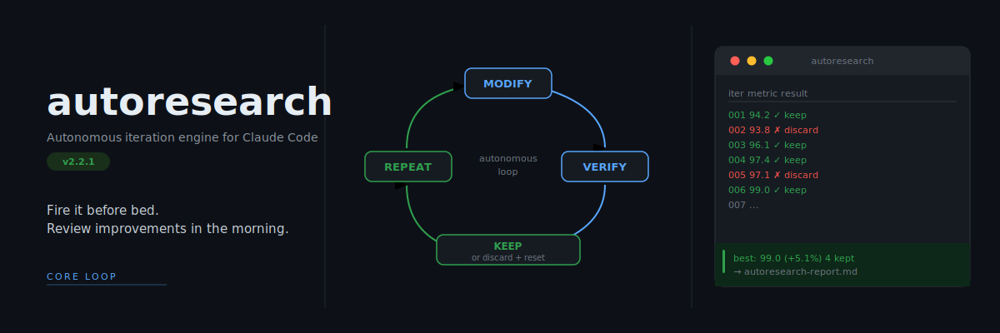

# Auto Research

[](https://github.com/Maleick/AutoResearch/releases)
[](LICENSE)
[](https://github.com/Maleick/AutoResearch/commits/main)
[](https://github.com/Maleick/AutoResearch/stargazers)
[](.)



> **v3.0.0** — [Website](https://maleick.github.io/claude-autoresearch/) · [Issues](https://github.com/Maleick/AutoResearch/issues)

Auto Research is a cross-platform autonomous iteration engine for coding agents. It keeps the existing Claude `/autoresearch` command surface intact, adds a root-centered Codex skill bundle and local Codex plugin, and positions the project as a reusable workflow system instead of a single-runtime package.

Inspired by [Karpathy's autoresearch](https://github.com/karpathy/autoresearch). The core loop is still the same:

**Modify -> Verify -> Keep or Discard -> Repeat**

## What changed in 3.0

- Public brand renamed to **Auto Research**
- Repository renamed to `Maleick/AutoResearch`
- Root `SKILL.md`, `references/`, `scripts/`, and `agents/` now act as the Codex-facing source of truth
- `plugins/codex-autoresearch` is generated from that root bundle
- `plugins/autoresearch` remains the Claude compatibility package with the stable `/autoresearch*` command family
- Results logging now supports both `research-results.tsv` and `autoresearch-results.tsv`

## Runtime surfaces

| Surface | Status | Entry point |
| --- | --- | --- |
| Claude | Stable compatibility layer | `/autoresearch`, `/autoresearch:plan`, `/autoresearch:debug`, `/autoresearch:fix`, `/autoresearch:learn`, `/autoresearch:predict`, `/autoresearch:scenario`, `/autoresearch:security`, `/autoresearch:ship` |
| Codex | First-class local plugin | `$codex-autoresearch` via root skill bundle or install `codex-autoresearch` from the repo marketplace |

## Repository layout

```text
SKILL.md                              # Root Auto Research skill bundle for Codex
agents/openai.yaml                    # Codex skill metadata
references/                           # Shared loop, mode, and runtime references
scripts/                              # Runtime helpers, sync, and validation tooling
plugins/autoresearch/                 # Claude compatibility package
plugins/codex-autoresearch/           # Codex plugin package mirrored from the root bundle
.agents/plugins/marketplace.json      # Repo-scoped Codex marketplace for local install/testing
docs/                                 # Public site and architecture docs
wiki/                                 # Reference docs
```

## Install

### Claude

```bash
claude plugin marketplace add Maleick/AutoResearch
claude plugin install autoresearch@Maleick-AutoResearch
```

The Claude package keeps the existing `autoresearch` identifiers for compatibility.

### Codex

This repository includes a repo-scoped Codex marketplace at [`.agents/plugins/marketplace.json`](.agents/plugins/marketplace.json).

1. Start Codex in this repository.
2. Open `/plugins`.
3. Choose the repo marketplace and install `codex-autoresearch`.

You can also invoke the root bundle directly with `$codex-autoresearch` while iterating on the plugin locally.

## Core loop

Auto Research requires a goal, scope, and a mechanical verification command. It then:

1. Baselines the current state.
2. Makes one focused experiment.
3. Verifies it mechanically.
4. Keeps strict improvements and discards regressions.
5. Records the result and continues until the stop condition is met.

Common artifacts:

| Artifact | Purpose |
| --- | --- |
| `autoresearch-state.json` | Checkpoint state for the current run |
| `research-results.tsv` | Primary Codex-facing iteration log |
| `autoresearch-results.tsv` | Claude-compatible results log alias |
| `autoresearch-report.md` | End-of-run report |
| `autoresearch-launch.json` | Background launch request |
| `autoresearch-memory.md` | Reusable memory for later runs |

## Development workflow

When you change the root bundle, re-sync and validate the Codex plugin payload:

```bash
python3 scripts/sync_plugin_payload.py --repo .
python3 scripts/check_plugin_distribution.py --repo .
pytest -q tests/test_plugin_distribution.py tests/test_results_compatibility.py
```

The public website URL still uses the historical `/claude-autoresearch/` path during the transition, but the GitHub repository and install references now point at `Maleick/AutoResearch`.
