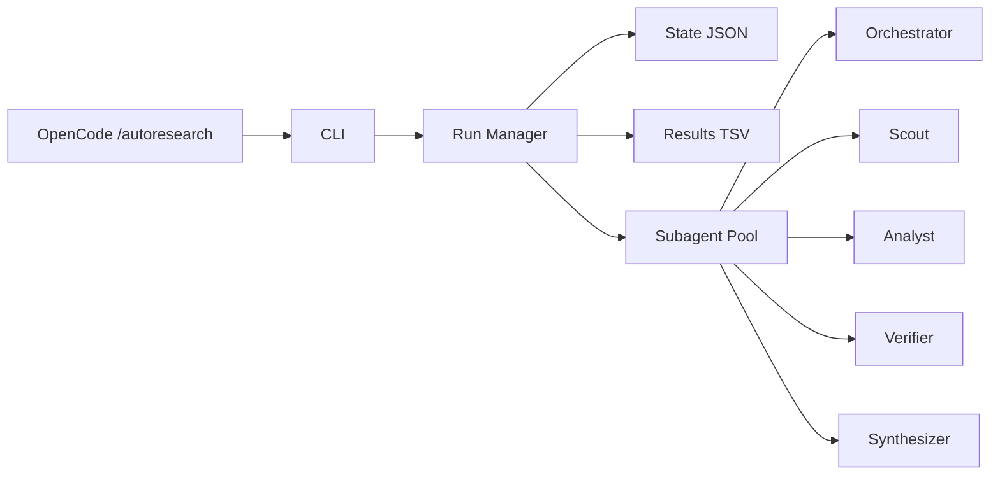
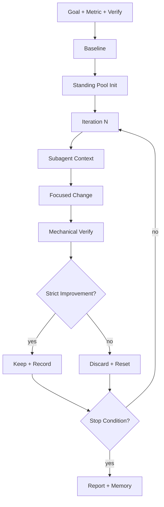
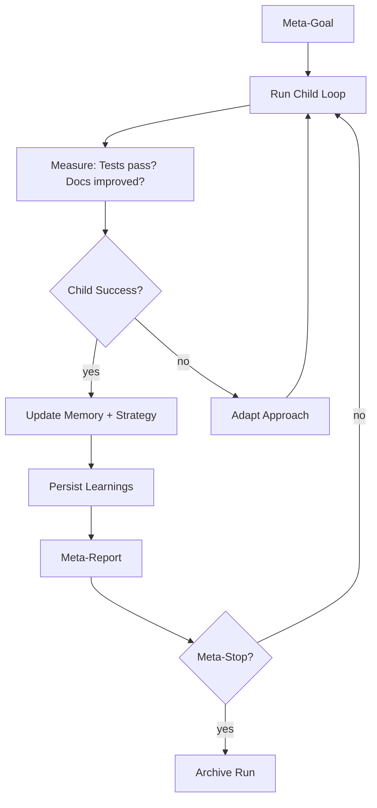
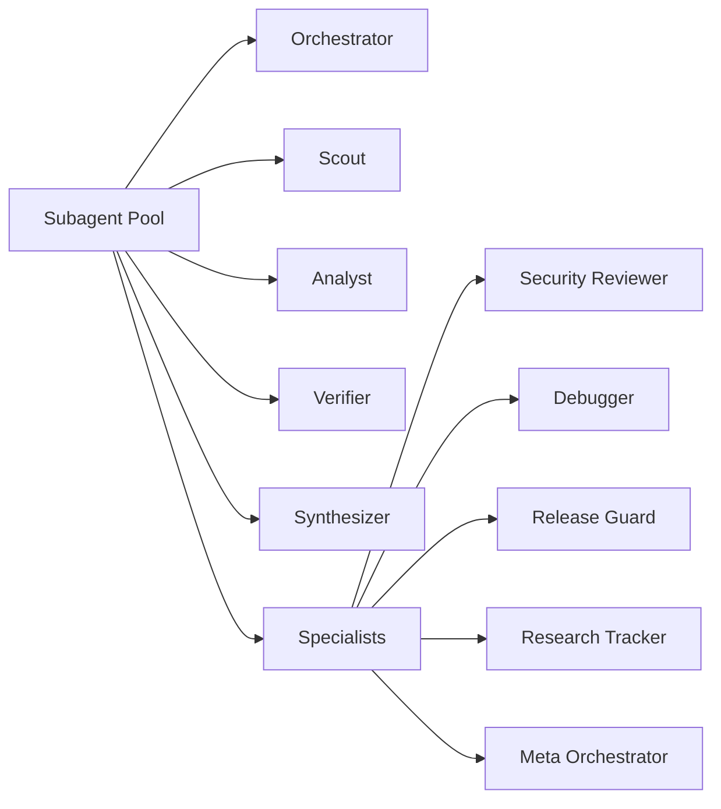
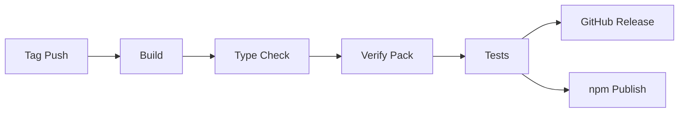

# Auto Research Architecture

> Current reference for v3.3.0.

Auto Research is an OpenCode-only npm package with recursive self-improvement capabilities. The runtime is Node.js ESM. All workflow semantics are preserved from earlier releases.

## Package Layout

```text
src/index.ts                   # Main plugin entry
src/cli.ts                     # CLI entry point
src/constants.ts               # Package constants (version, names, paths)
src/types.ts                   # TypeScript type definitions
src/helpers.ts                 # Runtime helpers (state, results, paths)
src/wizard.ts                  # Setup wizard
src/subagent-pool.ts           # Subagent pool builder
src/run-manager.ts             # Run lifecycle (init, record, status, stop, resume, complete)
commands/autoresearch.md        # Main command
commands/autoresearch/*.md     # Mode commands (plan, debug, fix, learn, etc.)
skills/autoresearch/           # OpenCode skill bundle
skills/autoresearch/references/# Workflow and runtime references
hooks/init.sh                  # SessionStart hook
hooks/status.sh                # Status hook
hooks/stop.sh                  # Stop hook
hooks/verify-package.sh        # Package verification
docs/OPENCODE_INSTALL.md       # OpenCode install guide
docs/ARCHITECTURE.md           # This document
docs/RELEASE.md                # Release process
plugins/autoresearch.ts        # OpenCode plugin entry point
.opencode-plugin/plugin.json   # OpenCode plugin manifest
.autoresearch/                 # Runtime state directory (created at runtime)
```

## High-Level Architecture



## Core Loop



## Self-Improvement Loop



## Source of Truth

`src/` is authoritative for runtime behavior. `commands/` and `skills/` define the OpenCode surfaces.

## Runtime Artifacts

| Artifact | Purpose |
| --- | --- |
| `.autoresearch/state.json` | Current run checkpoint |
| `autoresearch-results.tsv` | Iteration log |
| `.autoresearch/launch.json` | Background launch request |
| `autoresearch-report.md` | End-of-run report |
| `autoresearch-memory.md` | Reusable run memory |
| `.autoresearch/self-improvement.md` | Self-improvement run state |

## Command Surface

| Command | Workflow |
| --- | --- |
| `/autoresearch` | Default improve-verify loop |
| `/autoresearch:plan` | Planning workflow |
| `/autoresearch:debug` | Debugging workflow |
| `/autoresearch:fix` | Fix workflow |
| `/autoresearch:learn` | Learning workflow |
| `/autoresearch:predict` | Prediction workflow |
| `/autoresearch:scenario` | Scenario expansion |
| `/autoresearch:security` | Security review |
| `/autoresearch:ship` | Ship-readiness workflow |

## CLI Commands

| Command | Purpose |
| --- | --- |
| `autoresearch init` | Initialize a run |
| `autoresearch wizard` | Generate setup summary |
| `autoresearch status` | Print run status |
| `autoresearch launch` | Launch background run |
| `autoresearch stop` | Request stop |
| `autoresearch resume` | Resume background run |
| `autoresearch complete` | Mark run complete |
| `autoresearch record` | Record iteration result |
| `autoresearch doctor` | Verify installation |

## Subagent Pool



The standing pool provides:

| Role | Purpose |
| --- | --- |
| `orchestrator` | Owns goal, state, and keep/discard decisions |
| `scout` | Gathers context and surfaces opportunities |
| `analyst` | Challenges hypotheses and identifies risks |
| `verifier` | Runs mechanical verification independently |
| `synthesizer` | Compiles findings into next iteration plan |
| `security_reviewer` | Security-focused review variant |
| `debugger` | Debug workflow specialization |
| `release_guard` | Ship-readiness verification |
| `research_tracker` | Pattern tracking across iterations |
| `meta_orchestrator` | Owns meta-goal and child loop decisions (self-improvement) |

## Validation

1. `npm run typecheck` — TypeScript strict checks.
2. `npm run build` — Compile to `dist/`.
3. `npm run verify:pack` — Package contents verification.
4. `npm test` — Run test suite.
5. Package install and `autoresearch doctor` verification.

## Release Pipeline



The release workflow is automated via GitHub Actions:

1. Push a `v*.*.*` tag
2. GitHub Actions builds, type-checks, verifies package, runs tests
3. Creates a GitHub Release with CHANGELOG section
4. Publishes to npm automatically

## Migration from Earlier Releases

- Results log is now `autoresearch-results.tsv` only (dropped `research-results.tsv`).
- State is now in `.autoresearch/state.json` (was `autoresearch-state.json` at root).
- Runtime helpers are TypeScript (`src/helpers.ts`) not Python.
- Plugin format is `.opencode-plugin/plugin.json`.
- The Claude and Codex plugin bundles (`plugins/autoresearch/`, `plugins/codex-autoresearch/`) are no longer shipped.
- Self-improvement loop added in v3.2.0.
