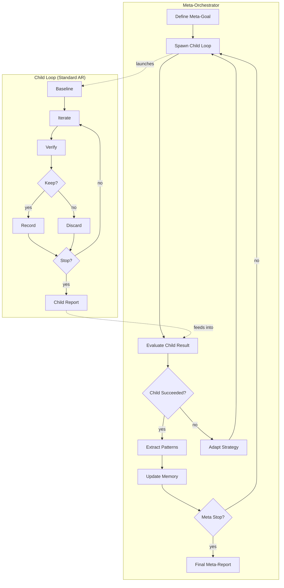

# Self-Improvement Loop

Use this reference when Auto Research should run on its own codebase or when setting up long-running recursive improvement cycles.

## Overview

The self-improvement loop is a **meta-orchestration layer** that sits above the standard improve-verify loop. It enables Auto Research to iteratively improve itself, its documentation, its test coverage, or any other measurable property of the autoresearch repository.



## Activation Contract

When invoked for self-improvement:

1. Read `references/core-principles.md`
2. Read `references/loop-workflow.md`
3. Read `references/subagent-orchestration.md`
4. Read this document (`references/self-improve-loop.md`)
5. Read `references/state-management.md` for artifact semantics
6. Read `references/results-logging.md` for record format

## Meta-Goal Definition

The meta-goal must be measurable and bounded:

- **Target**: What property of autoresearch should improve?
- **Metric**: Numeric measurement (e.g., test coverage %, doc completeness score)
- **Direction**: `lower` or `higher`
- **Verify**: Mechanical command that measures the metric
- **Guard**: Command that catches regressions in core functionality
- **Scope**: Which files/subsystems are in scope

### Example Meta-Goals

```bash
# Improve documentation coverage
autoresearch init \
  --goal "All public APIs have documentation" \
  --metric "doc_coverage_pct" \
  --direction "higher" \
  --verify "node scripts/measure-doc-coverage.js" \
  --guard "npm run typecheck && npm run build"

# Improve test coverage
autoresearch init \
  --goal "Increase branch coverage" \
  --metric "branch_coverage" \
  --direction "higher" \
  --verify "npm run test:coverage" \
  --guard "npm test"

# Reduce complexity
autoresearch init \
  --goal "Reduce cyclomatic complexity" \
  --metric "avg_complexity" \
  --direction "lower" \
  --verify "npx complexity-report src/" \
  --guard "npm test"
```

## Recursive Loop Phases

### Phase 1: Meta-Setup

1. Define meta-goal, metric, direction, verify, guard, and scope.
2. Baseline the current state of the autoresearch repository.
3. Initialize `autoresearch-memory.md` with known patterns and strategies.
4. Set iteration cap and wall-clock duration for the meta-loop.
5. Determine child loop parameters (iterations per child, stop conditions).

### Phase 2: Child Loop Execution

Each child loop is a standard Auto Research run:

1. Inherit meta-goal as child goal.
2. Run the standard improve-verify loop for N iterations or until child stop condition.
3. Produce child report: iterations, keeps, discards, best metric, patterns found.

### Phase 3: Meta-Evaluation

After each child loop completes:

1. Evaluate child success: Did metric improve? Were there regressions?
2. Extract reusable patterns from child results.
3. Update strategy based on pattern analysis.
4. Decide: spawn another child, adapt approach, or meta-stop.

### Phase 4: Memory Update

Persist learnings across meta-iterations:

1. Append successful patterns to `autoresearch-memory.md`.
2. Update `.autoresearch/state.json` with meta-run progress.
3. Record meta-iteration in `autoresearch-results.tsv` with `meta:` prefix.

## Memory Format

The memory file tracks patterns that persist across runs:

```markdown
# Auto Research Memory

## Successful Patterns

### Pattern: Incremental doc improvements
- Context: Adding mermaid diagrams to README
- Approach: One diagram per iteration, verify render
- Result: 3/3 kept, no regressions
- Confidence: high

### Pattern: Test-first for new features
- Context: Adding self-improvement loop
- Approach: Write test, implement, verify
- Result: 5/7 kept, 2 discards due to edge cases
- Confidence: medium

## Failed Approaches

### Approach: Large rewrite of state manager
- Context: Trying to simplify run-manager.ts
- Result: 0/3 kept, multiple guard failures
- Lesson: Prefer incremental changes over rewrites

## Strategy Recommendations

- For docs: incremental, one section per iteration
- For tests: test-first, small units
- For refactoring: typecheck-first, then test
```

## Meta-Stop Conditions

Stop the recursive loop when:

1. **Goal met**: Metric reaches target threshold.
2. **Diminishing returns**: N consecutive child loops with no improvement.
3. **Iteration cap**: Meta-iteration cap reached.
4. **Duration elapsed**: Wall-clock cap exceeded.
5. **User request**: Explicit stop requested.
6. **Needs human**: Child loop surfaces blocker requiring human input.

## Meta-Iteration Record Format

Meta-iterations are recorded with a `meta:` prefix in the results log:

```tsv
timestamp	iteration	decision	metric_value	verify_status	guard_status	hypothesis	change_summary	labels	note
2024-01-15T10:00:00Z	meta:001	keep	68.5	pass	pass	strategy:incremental_docs	Child loop 001 completed with 5/7 kept	doc,meta	Pattern: one diagram per iteration
```

## Background Self-Improvement

For overnight or long-running self-improvement:

```bash
autoresearch init \
  --goal "Improve AutoResearch documentation and test coverage" \
  --metric "combined_score" \
  --direction "higher" \
  --verify "node scripts/combined-score.js" \
  --guard "npm run typecheck && npm test" \
  --mode "background" \
  --iterations "50" \
  --duration "8h" \
  --scope "src/,docs/,wiki/,skills/"

autoresearch launch
```

The background supervisor (`autoresearch status`) will:

1. Check child loop status periodically.
2. Spawn new child loops when previous ones complete.
3. Stop if meta-stop conditions are met.
4. Resume from `.autoresearch/state.json` on restart.

## Safety

Self-improvement loops have additional guardrails:

1. **Scope enforcement**: Only modify files within declared scope.
2. **Guard command**: Must pass before any keep decision.
3. **Backup state**: Archive `.autoresearch/state.json` before each meta-iteration.
4. **Human checkpoint**: Optional `needs_human` flag after N meta-iterations.
5. **Rollback strategy**: Documented in memory for each pattern.

## Subagent Pool for Self-Improvement

The standing pool for self-improvement includes:

| Role | Purpose |
| --- | --- |
| `meta_orchestrator` | Owns meta-goal and child loop decisions |
| `child_orchestrator` | Runs standard loop within child context |
| `pattern_analyst` | Extracts patterns from child results |
| `strategy_advisor` | Recommends tactic changes |
| `regression_guard` | Extra verification for self-modification |
| `doc_reviewer` | Reviews documentation changes |
| `test_designer` | Designs tests for new functionality |

## Example Full Recursive Session

```text
$ autoresearch init --goal "Improve README and add mermaid diagrams" \
  --metric "doc_completeness" --direction higher \
  --verify "node scripts/score-docs.js" --mode background

[meta-001] Child loop launched: 10 iterations
[child-001] Baseline: doc_completeness = 42
[child-001] iter 001: keep (diagram added, score 48)
[child-001] iter 002: keep (diagram added, score 53)
[child-001] iter 003: discard (diagram broken)
[child-001] iter 004: keep (diagram fixed, score 55)
...
[child-001] Complete: 7/10 kept, best score 61

[meta-001] Pattern: SVG diagrams > mermaid for banners
[meta-001] Pattern: One section per iteration is optimal
[meta-002] Strategy adapted: Focus on wiki next
[meta-002] Child loop launched: 10 iterations
...

[meta-stop] Goal threshold reached (80/100)
[meta-complete] Report: autoresearch-report.md
[meta-complete] Memory: autoresearch-memory.md
```
