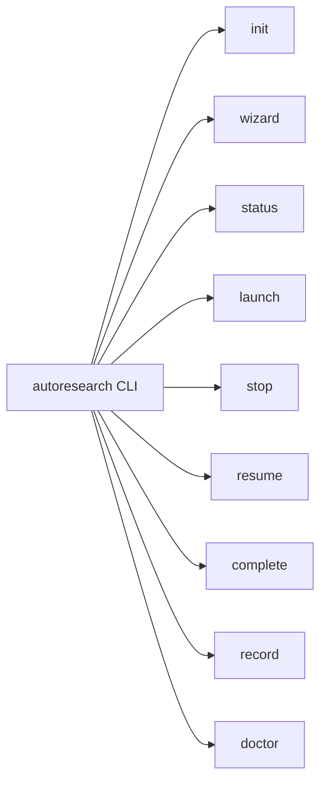
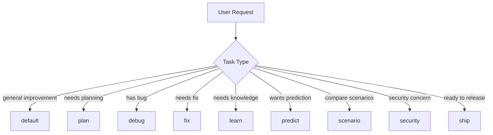
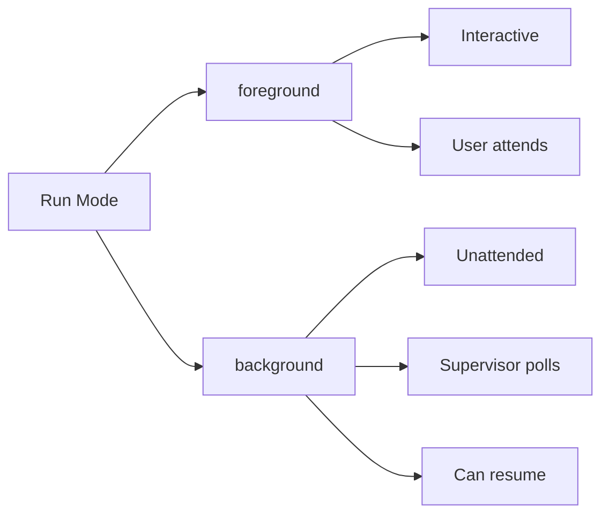

# Commands

## OpenCode Command Surface

The command family is fully supported in OpenCode:

```mermaid
flowchart TD
    A[/autoresearch] --> B[Default Loop]
    A --> C[Specialized Modes]
    C --> D[/autoresearch:plan]
    C --> E[/autoresearch:debug]
    C --> F[/autoresearch:fix]
    C --> G[/autoresearch:learn]
    C --> H[/autoresearch:predict]
    C --> I[/autoresearch:scenario]
    C --> J[/autoresearch:security]
    C --> K[/autoresearch:ship]
```

- `/autoresearch` — Default improve-verify loop
- `/autoresearch:plan` — Planning workflow
- `/autoresearch:debug` — Debugging workflow
- `/autoresearch:fix` — Fix workflow
- `/autoresearch:learn` — Learning workflow
- `/autoresearch:predict` — Prediction workflow
- `/autoresearch:scenario` — Scenario expansion
- `/autoresearch:security` — Security review
- `/autoresearch:ship` — Ship-readiness workflow

## New in v3.3.0

- `/autoresearch` now supports **recursive self-improvement** via `meta_orchestrator` role
- Enhanced subagent pool with `pattern_analyst`, `strategy_advisor`, `regression_guard`
- Background runs now persist memory across meta-iterations

## CLI

The `autoresearch` CLI provides background and foreground run control:



- `autoresearch init` — Initialize a run
- `autoresearch wizard` — Generate setup summary
- `autoresearch status` — Print run status
- `autoresearch launch` — Launch background run
- `autoresearch stop` — Request stop
- `autoresearch resume` — Resume background run
- `autoresearch complete` — Mark run complete
- `autoresearch record` — Record iteration result
- `autoresearch doctor` — Verify installation

## Mode Routing



- **default**: Improve-verify loop with metric tracking
- **plan**: Setup planning before iteration
- **debug**: Debugging workflow
- **fix**: Targeted repair workflow
- **learn**: Knowledge acquisition
- **predict**: Outcome prediction
- **scenario**: Scenario comparison
- **security**: Security review
- **ship**: Ship-readiness check

## Background vs Foreground



| Mode | Use When |
| --- | --- |
| `foreground` | Interactive development, user present |
| `background` | Overnight runs, self-improvement, CI/CD |

Background runs create `.autoresearch/state.json` and can be resumed with `autoresearch resume`.