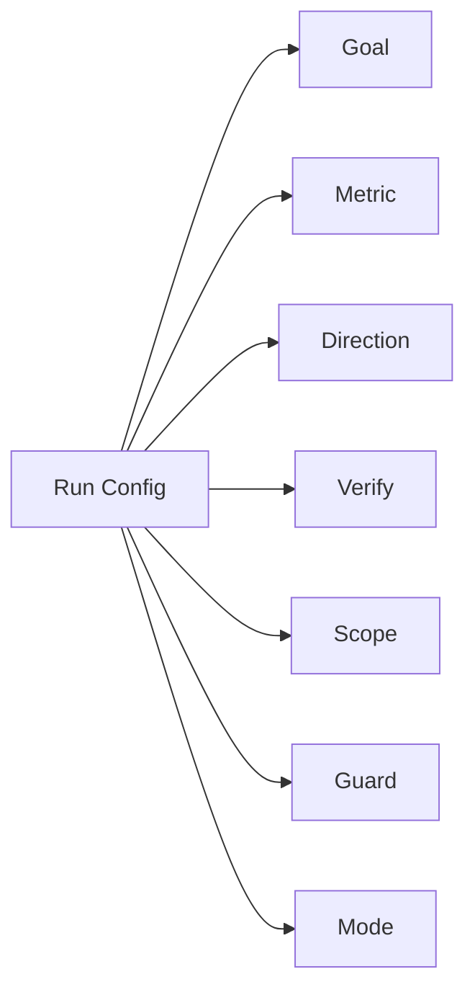
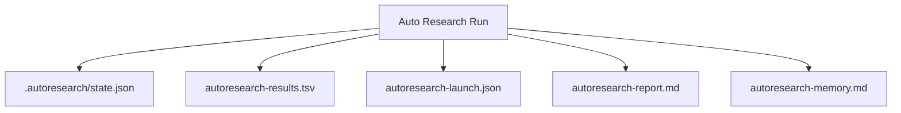
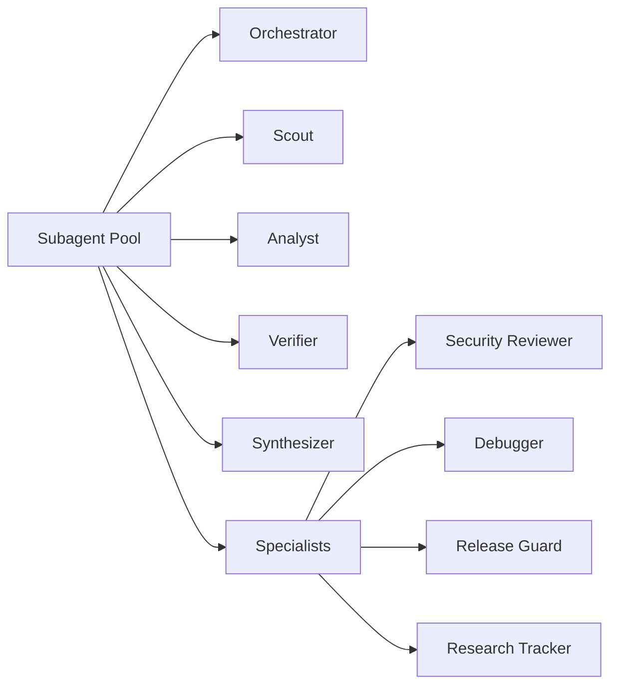

# Configuration

## Core Fields

Auto Research revolves around these fields:



- `Goal` — What outcome to optimize
- `Scope` — In-scope files or subsystem
- `Metric` — Numeric metric that tracks progress
- `Direction` — `lower` or `higher`
- `Verify` — Mechanical command that measures the metric

Common optional fields:

- `Guard` — Guard command for regression catch
- `Iterations` — Iteration cap
- `Duration` — Wall-clock cap (e.g., `5h` or `300m`)
- `Run Mode` — `foreground` or `background`
- `Memory Path` — Custom path for reusable memory
- `Required Keep Labels` — Labels required for keep decisions
- `Required Stop Labels` — Labels that trigger stop when present

## Runtime Artifacts



| Artifact | Purpose |
| --- | --- |
| `.autoresearch/state.json` | Current run checkpoint |
| `autoresearch-results.tsv` | Iteration log |
| `autoresearch-launch.json` | Background launch manifest |
| `autoresearch-report.md` | End-of-run report |
| `autoresearch-memory.md` | Reusable memory |

## Subagent Pool

The standing pool provides specialized roles:



The pool is reused across iterations unless drift or repeated discards force a reset.

## CLI Configuration

```bash
autoresearch init --goal "..." --metric "..." --direction "lower" --verify "npm test"
autoresearch init --repo /path/to/repo --results-path results.tsv --state-path state.json
```

### Full Configuration Example

```bash
autoresearch init \
  --goal "Reduce bundle size" \
  --metric "bundle_size_kb" \
  --direction "lower" \
  --verify "node scripts/measure-bundle.js" \
  --guard "npm test" \
  --mode "background" \
  --scope "src/" \
  --iterations "30" \
  --duration "4h" \
  --memory-path "./memory/autoresearch-memory.md"
```

See [docs/ARCHITECTURE.md](docs/ARCHITECTURE.md) for full artifact reference.

## State File Structure

```json
{
  "schema_version": 1,
  "run_id": "run-abc123",
  "status": "running",
  "mode": "background",
  "goal": "Reduce bundle size",
  "metric": {
    "name": "bundle_size_kb",
    "direction": "lower",
    "baseline": "245.6",
    "best": "198.3",
    "latest": "201.1"
  },
  "verify": "node scripts/measure-bundle.js",
  "guard": "npm test",
  "stats": {
    "total_iterations": 12,
    "kept": 8,
    "discarded": 4,
    "needs_human": 0,
    "consecutive_discards": 1
  },
  "flags": {
    "stop_requested": false,
    "needs_human": false,
    "background_active": true,
    "stop_ready": false
  }
}
```