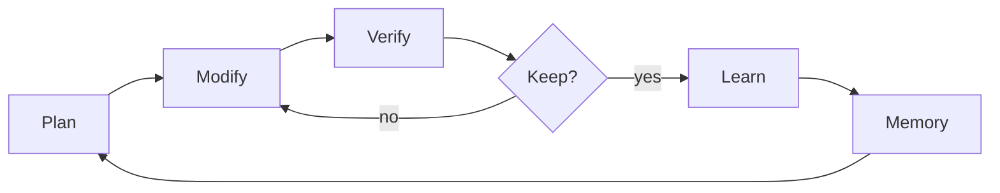
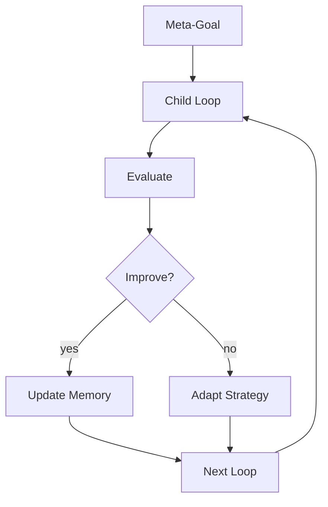

# Auto Research Wiki

Auto Research is a **subagent-first autonomous iteration engine** for OpenCode with support for recursive self-improvement loops.

## Pages

| Page | Purpose |
| --- | --- |
| [Installation](Installation.md) | OpenCode install via npm |
| [Commands](Commands.md) | Command surface and mode workflows |
| [Configuration](Configuration.md) | Core fields, artifacts, and runtime state |
| [Safety](Safety.md) | Safety model and artifact discipline |
| [Contributing](Contributing.md) | Source of truth and packaging workflow |
| [Self-Improvement](Self-Improvement.md) | Recursive loop and meta-orchestration |

## Quick Navigation

```mermaid
flowchart TD
    A[Auto Research Wiki] --> B[Installation]
    A --> C[Commands]
    A --> D[Configuration]
    A --> E[Safety]
    A --> F[Contributing]
    A --> G[Self-Improvement]
    C --> H[/autoresearch]
    C --> I[/autoresearch:plan]
    C --> J[/autoresearch:debug]
    C --> K[/autoresearch:fix]
    C --> L[/autoresearch:learn]
    C --> M[/autoresearch:predict]
    C --> N[/autoresearch:scenario]
    C --> O[/autoresearch:security]
    C --> P[/autoresearch:ship]
```

## What Is Auto Research?

Auto Research runs a disciplined loop:



1. **Plan** — Define goal, metric, and verification
2. **Modify** — Make one focused change
3. **Verify** — Check mechanically, never by intuition
4. **Keep/Discard** — Strict improvement only
5. **Learn** — Extract patterns for future runs
6. **Repeat** — Continue until stop condition

## Current Positioning

- Public product name: **Auto Research**
- Repository: `Maleick/AutoResearch`
- Package: `opencode-autoresearch`
- Runtime: OpenCode only (v3.2.0+)
- License: MIT

## Self-Improvement at a Glance

Auto Research can improve itself:



See [Self-Improvement](Self-Improvement.md) for the full recursive loop specification.