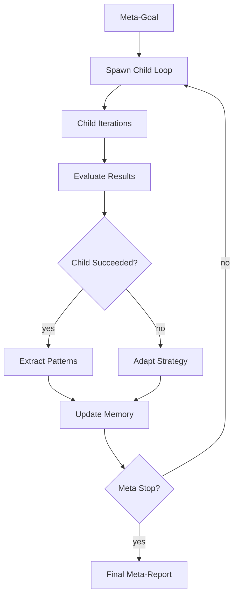

# Self-Improvement

Auto Research supports **recursive self-improvement loops** — running the iteration engine on its own codebase to improve tests, documentation, architecture, or any measurable property.

## The Recursive Loop



## How It Works

1. **Meta-Setup**: Define a meta-goal (e.g., "Improve documentation coverage")
2. **Child Loop**: Run standard Auto Research with the meta-goal as its goal
3. **Evaluation**: After child completes, evaluate success and extract patterns
4. **Adaptation**: Update strategy based on what worked and what didn't
5. **Memory**: Persist learnings to `autoresearch-memory.md`
6. **Repeat**: Spawn new child loops until meta-stop conditions are met

## Meta-Goal Examples

### Improve Documentation

```bash
autoresearch init \
  --goal "All public APIs have documentation" \
  --metric "doc_coverage_pct" \
  --direction "higher" \
  --verify "node scripts/measure-doc-coverage.js" \
  --guard "npm run typecheck && npm run build" \
  --mode "background" \
  --scope "src/,docs/,wiki/"
```

### Increase Test Coverage

```bash
autoresearch init \
  --goal "Increase branch coverage" \
  --metric "branch_coverage" \
  --direction "higher" \
  --verify "npm run test:coverage" \
  --guard "npm test" \
  --mode "background"
```

### Reduce Complexity

```bash
autoresearch init \
  --goal "Reduce cyclomatic complexity" \
  --metric "avg_complexity" \
  --direction "lower" \
  --verify "npx complexity-report src/" \
  --guard "npm test"
```

## Memory File

The memory file tracks patterns across meta-iterations:

```markdown
# Auto Research Memory

## Successful Patterns

### Pattern: Incremental doc improvements
- Context: Adding mermaid diagrams
- Approach: One diagram per iteration
- Result: 3/3 kept
- Confidence: high

## Failed Approaches

### Approach: Large rewrite
- Context: Refactoring state manager
- Result: 0/3 kept
- Lesson: Prefer incremental changes
```

## Meta-Stop Conditions

Stop the recursive loop when:

- Goal threshold reached
- Diminishing returns (N consecutive loops with no improvement)
- Iteration cap reached
- Duration elapsed
- User requests stop
- Needs human flag set

## Background Self-Improvement

For long-running unattended improvement:

```bash
autoresearch init \
  --goal "Improve AutoResearch" \
  --metric "combined_score" \
  --direction "higher" \
  --verify "node scripts/combined-score.js" \
  --guard "npm run typecheck && npm test" \
  --mode "background" \
  --iterations "50" \
  --duration "8h"

autoresearch launch
```

The background supervisor will spawn child loops, evaluate results, and adapt strategy automatically.

## Safety

Self-improvement loops have additional guardrails:

- **Scope enforcement**: Only modify declared files
- **Guard command**: Must pass before keep
- **State backups**: Archive state before each meta-iteration
- **Human checkpoints**: Optional pause after N meta-iterations
- **Rollback**: Documented in memory for each pattern

## See Also

- [Configuration](Configuration.md) — Core fields and artifacts
- [Commands](Commands.md) — CLI and OpenCode commands
- `skills/autoresearch/references/self-improve-loop.md` — Full specification